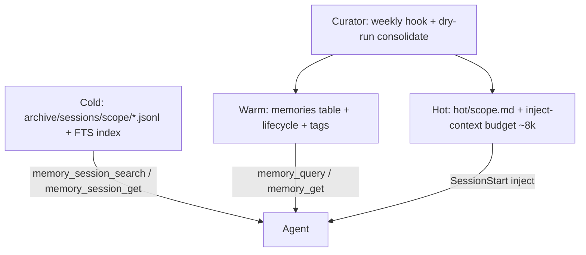

# Memory Agent — Hermes-Inspired Architecture Summary

*Completed 2026-05-22 · [mcp-memory-agent](https://github.com/nathanmauro/memory-agent)*

---

## Overview

Built Hermes-inspired tiered memory for **mcp-memory-agent**: cold archive, warm structured memories, bounded hot context, dry-run curator, and v2 extras (open actions, editable hot files, session thaw, Codex parity).

**Design principles kept throughout:**
- Selectivity is cognition — carry an index, thaw on demand
- Inspectability beats density — plain text everywhere
- Agent proposes, human disposes — dry-run default on destructive ops

---

## Architecture



### On-disk layout

Default root: `MEMORY_AGENT_HOME` → `~/.claude/memory/`

| Path | Purpose |
|------|---------|
| `memory.db` | Warm memories + session FTS index |
| `sessions/*.jsonl` | Ephemeral per-session buffers |
| `archive/sessions/{scope}/*.jsonl` | Cold transcript source of truth |
| `hot/{scope}.md` | Curated hot memory (8k char cap) |
| `proposals/` | Dry-run consolidate output |
| `backups/` | Snapshots before `apply=True` |

---

## v1 — Four stacked phases

Branches were stacked (each built on the previous), opened as stacked PRs, all merged to `master`.

| Phase | Branch | PR | What shipped |
|-------|--------|-----|--------------|
| 1 | `v1/phase-1-cold-archive` | [#2](https://github.com/nathanmauro/memory-agent/pull/2) | Archive JSONL to `archive/sessions/{scope}/`; FTS index; **`memory_session_search`** |
| 2 | `v1/phase-2-lifecycle` | [#3](https://github.com/nathanmauro/memory-agent/pull/3) | `status`, `last_accessed_at`, `access_count`, `pinned`; access tracking on get/query/index |
| 3 | `v1/phase-3-bounded-inject` | [#4](https://github.com/nathanmauro/memory-agent/pull/4) | ~8k char budgeted `inject-context`: warm memories + cold session pointers |
| 4 | `v1/phase-4-dry-run-curator` | [#5](https://github.com/nathanmauro/memory-agent/pull/5) | **`memory_consolidate(scope, apply=False)`** default; proposals/backups; tests + README |

**Review order:** #2 → #3 → #4 → #5 (each PR base was the prior branch).

---

## v2 — Five phases (one skipped)

| Phase | Branch | PR | What shipped |
|-------|--------|-----|--------------|
| 1 | `v2/phase-1-tag-actions` | [#6](https://github.com/nathanmauro/memory-agent/pull/6) | `open_actions[]` + richer tags in summarizer; **`open_action`** category (cap 3/session) |
| 2 | `v2/phase-2-hot-memory` | [#7](https://github.com/nathanmauro/memory-agent/pull/7) | `hot/{scope}.md`; **`memory_hot_read`** / **`memory_hot_edit`**; hot loaded first in inject |
| 3 | `v2/phase-3-curator` | [#9](https://github.com/nathanmauro/memory-agent/pull/9) | Weekly **`curator`** hook; lifecycle stale/archive; dry-run consolidate proposals |
| 4 | `v2/phase-4-session-get` | [#10](https://github.com/nathanmauro/memory-agent/pull/10) | **`memory_session_get`** — full archived transcript thaw |
| 5 | `v2/phase-5-codex-parity` | [#11](https://github.com/nathanmauro/memory-agent/pull/11) | Codex `SessionStart` inject + curator; multi-client install |
| 6 | — | — | **Skipped:** Notion substrate router |

> PR [#8](https://github.com/nathanmauro/memory-agent/pull/8) was opened during hot-memory work but superseded by **#7**, which merged.

---

## Current `master`

Tip commit area: `5af7ab3`

```
5af7ab3  Hermes memory architecture milestone summary (#12)
696f0d7  Codex inject-context parity (#11)
60cbb1f  memory_session_get (#10)
a938aed  Weekly curator hook (#9)
3b9aa5d  Editable hot memory (#7)
3c1b58f  Open actions + richer tags
aa17781  Cold session archive + memory_session_search
```

### MCP tools (12 total)

| Tool | Layer |
|------|-------|
| `memory_store` | Warm |
| `memory_query` / `memory_index` / `memory_get` | Warm |
| `memory_list` / `memory_timeline` / `memory_forget` | Warm |
| `memory_session_search` | Cold |
| `memory_session_get` | Cold |
| `memory_hot_read` / `memory_hot_edit` | Hot |
| `memory_consolidate(scope, apply=False)` | Curator |

### Memory categories

`session_summary`, `code_decision`, `user_preference`, `project_knowledge`, **`open_action`**

### Hooks

**Claude (`~/.claude/settings.json`):**

| Event | Action |
|-------|--------|
| SessionStart | sweep → inject-context → curator (weekly) |
| UserPromptSubmit | record prompt |
| PostToolUse | record tool_use |
| SessionEnd | finalize-session (archive → summarize → warm insert) |

**Codex (`.codex/hooks.json`):**

| Event | Action |
|-------|--------|
| SessionStart | inject-context + curator |
| PostToolUse | record tool_use |
| Stop | finalize-session |

---

## Branches

**Merged (remote branches deleted after squash merge):**

- `v1/phase-1-cold-archive` … `v1/phase-4-dry-run-curator`
- `v2/phase-1-tag-actions`, `v2/phase-2-hot-memory`, `v2/phase-3-curator`, `v2/phase-4-session-get`, `v2/phase-5-codex-parity`

**Not merged / leftover:**

- `cursor/4c88af17` — original worktree branch
- `stash@{0}` — unrelated WIP (install refactor, docs, etc.) on `cursor/4c88af17`
- Untracked `src/mcp_memory_agent/integrations/` — earlier WIP

---

## Tests

```bash
.venv/bin/python -m tests.test_validation
# 28 passed, 0 failed (after follow-up fixes)
```

---

## Install / smoke-test

```bash
git checkout master && git pull
.venv/bin/python -m mcp_memory_agent.install --client claude
# or:
.venv/bin/python -m mcp_memory_agent.install --client codex
# Codex also requires: [features] codex_hooks = true in ~/.codex/config.toml
```

**Smoke-test checklist:**
- [ ] End a session → `archive/sessions/{scope}/` gets a JSONL file
- [ ] `memory_session_search("keyword")` returns archived hits
- [ ] `memory_session_get("<session_id>")` returns full transcript
- [ ] `memory_hot_read(scope)` / `memory_hot_edit(...)` work within 8k cap
- [ ] `memory_consolidate(scope, apply=False)` writes a proposal in `proposals/`
- [ ] SessionStart inject includes hot + warm + cold pointers

---

## Explicitly not done

- Neuralese / learned codebooks
- Vector DB primary retrieval
- Notion substrate router
- Auto-delete of archived content

---

## Origin

Started from a conversation about Hermes Agent's tiered memory: cross-session correlation, glacier-with-pointers, selectivity-as-cognition (Borges / *Funes the Memorious*), and inspectable plain-text storage over opaque compression.
